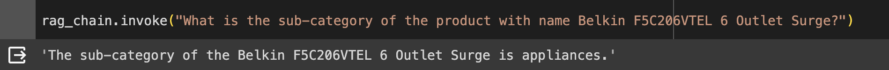

# Superstore Product Q&A System

This project aims to develop a Q&A system focused on superstore products, leveraging Retrieval-Augmented Generation (RAG) and LangChain technologies. The system is designed to facilitate product-related knowledge retrieval and provide informative responses to user queries. This README provides an overview of the project, its structure, and instructions for running it locally.

## Project Overview
### Description
This project implements a Q&A system specifically tailored to superstore datasets, utilizing the latest advancements in RAG and LangChain in only a few lines of code. The system leverages the available superstore dataset provided to generate informative responses to user queries. The project is developed using Python and incorporates frameworks like LangChain for conversational AI, along with NLP models. The system is obviously not-perfect and has hallucinations, but does provide accurate results a majority of the time. Users can input questions about the csv dataset, such as "What is the profit of the product with x name?", and the output will be the correct, corresponding profit. This applies to any other feature of the dataset too. 

### Project Structure
question-answer-rag.py: RAG Q$A system/model. \
README.md: This file. 

### How to Run Locally
Originally, this project was on Google Colab to have access to the dataset and GPU (chunking during RAG took a lot of time on just my CPU), and transferred here for submission. To run locally, installing the following necessary dependencies will be required: Python 3.7 or above and LangChain. You will also need a free Cohere API key that allows you to use the LLM/Embeddings model. I tried uploading to Gradio to provide an interactive experience, but ran into issues. The dataset is just the Superstore.csv, provided. Running the question-answer-rag.py will output a response to the question that was inputted in the rag_chain.invoke() method. 

### Screenshots
An example is as follows: \

